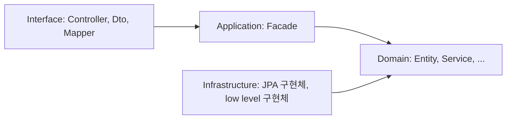
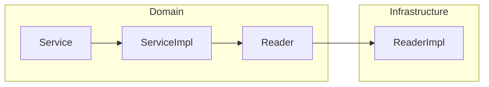

# Layered Architecture
- https://velog.io/@hyun6ik/Layer-%EA%B3%84%EC%B8%B5
- Layer간의 단방향 의존관계
- 계층간 호출 = 인터페이스

## 구성 요소
### Interface
- 사용자에게 정보를 보여주고 해석
- e.g. Controller, Dto, Mapper(Converter)

### Application
- 수행할 작업 정의
- 표현력 있는 도메인 객체가 문제 해결하게 지시
- 업무상 중요하거나, 다른 시스템의 app 계층과 **상호 작용**시 필요한 부분
- 이 계층은 얇게 유지됨
- 오직 작업을 조정하고 아래에 위치한 계층에 포함된 **도메인 객체**의 협력자에게 작업 위임
- e.g. Facade

### Domain
- 업무 개념, 업무 상황 정보, 업무 규칙 표현
- 업무 상황 반영하는 상태 제어, 사용
- **기술적 세부사항은 Infrastructure에 위임**
- e.g. Entity, Service, Command, Criteria, Info, Reader, Store, Executor, Factory(Interface)

### Infrastructure
- 상위 계층을 지원하는 일반화된 **기술적 기능** 제공
- app에 대한 메세지 전송, 도메인 영속화, UI 위젯을 그리기
- e.g. low level 구현체(ReaderImpl, StoreImpl, Spring JPA, RedisConnector, ...)

### Layer간 참조 관계

## Domain Layer
### domain layer의 `Service`에서는 **해당 도메인의 전체 흐름**을 파악할 수 있어야 함
- 도메인은 어떤 기술은 중요하지 x
- 어떤 업무를 어떤 순서로 처리했는가
- 적절한 interface를 사용하여 추상화
  - 실제 구현은 다른 layer에 맡김
- 세부적 기술구현은 Service가 아니라 `infrastructure::implements` 클래스 위임
  - Service에서는 이를 활용하기 위한 interface 선언 및 사용
  - DIP 활용. 도메인이 사용하는 interface 실제 구현체 Injection
  - 영속화된 객체를 로딩하기 위해 `Spring JPA, QueryDSL`

### domain layer의 모든 클래스명이 `*Service` 선언 필요 x
- 하나의 도메인 패키지에 Service 클래스가 존재하면,
  - 도메인 전체의 흐름을 컨트롤 하는 `Service`가 무엇인지 파악이 어려움
- **주요 도메인 흐름 관리**는 `Service` 하나로 유지
  - support 클래스는 Service 이외의 네이밍
- 하나의 책임을 가져가는 각각의 구현체, 책임과 역할에 맞는 네이밍으로 선언
  - domain layer에는 interface로 추상화
  - infrastructure에서 구현체
- doamin layer, 도메인 로직의 흐름 표현
  - Service, ServiceImpl이 존재
  - 상세 구현은 Reader, Store, Executor Interface 선언 및 사용
  - 실제 구현체는 Infrastructure Layer에 두고 활용
- FLOW

### Service 간에는 참조 관계를 가지지 X
- DDD::Aggreate Root와 유사하게
  - domain내의 `Entity`간에도 상하관계가 있음
- Service로직 구현시에도 hierarchy가 존재
  - 하지만 이런 구조를 허용하면, 상위/하위레벨의 관계가 발생
  - 테스트 하기 어려워짐
- **Service 간에는 참조 관계를 가지지 않도록 원칙을 세우는 것이 좋음**
